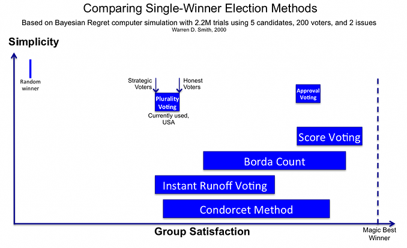

No, this is not about the 2016 U.S. election. Not *just* that, anyway.

First, I need to explain a weird glitch in our voting system.
Let's say there's two candidates, Steven Square () and Tracy Triangle (), on a couple political axes. (for example, “left vs. right” and “globalist vs. nationalist”) Let's also say there's a voter () simply votes for whoever's political position is closest. What would that look like?

**drag the candidates & voter around, and see how that changes their vote:**

It's a tough choice. Triangle's got some sharp points, but Square sees things from more sides. But in the end, you can only vote for one.

Of course, there's more than just one voter in an election. (one would hope so, anyway!) Let's simulate what an election would look like with 100+ voters.

**drag the candidates & voter_s_ around, and see how that changes the election:**

Now let's consider a different election. Say Tracy Triangle is *already* beating Steven Square in the polls, and a third candidate, Henry Hexagon (), sees this. (Hexagon's supporters like how he tackles problems from more angles) Inspired by her success, Hexagon swoops in and takes a political position close to Triangle's.

Now, you'd think giving the voters more of what they want should result in a *better* choice, or at least, not result in a *worse* choice, right? Well...

**at first,  beats .
drag  to *just under* ,
and see what happens:**

That's right. Steven Square, our *least* popular candidate, now wins! This is because when you have two good candidates, they "steal" votes from each other, letting a bad third candidate win.

This is called **the spoiler effect.** The most famous real-world example of this was in 2000, when Ralph Nader "stole" votes from Al Gore, letting George Bush win. And though the spoiler effect didn't play a big role in 2016, its impact could still be felt.

In the Republican primary, one anti-establishment nominee – Trump – ran against *sixteen* GOP establishment nominees, who all "stole" votes from each other, letting Trump grab the nomination, easily. As for the Democratic primary, fear of splitting the vote prevented Sanders from running as independent. And to cap it all off, there was always the worry that other candidates like Johnson, Stein, and McMullin could spoil the election.

But again, this is *not* about the 2016 U.S. election.

**This is about designing a democracy that people can *trust*.**

Despite so much hoopla around the 2016 election, a full *half* of Americans did not vote. Even of those who voted for Clinton/Trump, over 20% of them said their candidates were untrustworthy, *and voted for them anyway.* And around the world, people's trust in their governments – or the trust*worthiness* of their governments – has never been lower. It's more than America at stake. It's *every democracy in the world.*

...so yeah, no pressure.

Rebuilding trust is a complex problem with no easy solutions – but I think there *is* an easy first step. It's a step that could get rid of our “lesser of two evils” problem, and give us citizens more choices, *better* choices. And yet, it won't be as daunting as fixing campaign finance or gerrymandering or political gridlock, no, it'd just require changing *a piece of paper*, and how we count those pieces of paper.

This idea is *not* the most important issue. It *won't* solve everything. But as a first step? It'd give us the biggest bang-for-buck.

**Let's talk about how to build a better ballot.**

---

Lemme address a couple concerns first.

First objection. Why would the people in power wanna change the voting system that *got* them in power? Well – the spoiler effect has historically hurt *both* major parties, not just the minor parties. Getting rid of that glitch would be a win-win-win! Also, voting reform is already picking up steam worldwide. Just last month, [Maine adopted Instant Runoff Voting](http://www.nytimes.com/2016/12/03/us/maine-ranked-choice-voting.html), and Justin Trudeau, [Cutie-In-Chief of Canada](http://cdn.pinknews.co.uk/images/2016/02/justin_trudeau.jpg), will be moving his nation towards a better voting system in 2017.

Second objection. Didn't some guy prove that *all* voting systems will be unfair? Not quite. You're thinking of the infamous [Impossibility Theorem](https://en.wikipedia.org/wiki/Arrow%27s_impossibility_theorem) by Kenneth Arrow, the mathematician in the 1950's who founded the whole study of voting systems!

But 1) some voting systems can still be *more* fair than others, even if none are perfect. And 2) *that's actually a misconception* – Kenneth Arrow's proof only applies to voting systems *where you rank candidates*. His proof doesn't cover voting systems where you *don't* rank candidates. We'll see a couple of those, later – along with a few of the most popular alternatives to our current, glitchy voting system.

But first, let's take a closer look at the voting system we *do* have:

###FIRST PAST THE POST (FPTP)

// ballot

**How To Count:** Simply add up the votes. Whoever gets the most votes, wins.

Sounds logical enough. But as you saw earlier, it can lead to a weird glitch, where having two *good* candidates can make the election go to a third *bad* candidate. This is why some people vote "strategically", voting not for their actual honest favorite, but voting for the lesser of two evils. And strategic voting is fine – but! – ask yourself this: how can we expect our elected officials to be honest, when our voting system *itself* doesn't let us be honest?

So, to fix the spoiler effect, other voting systems have been suggested. Such as...

###RANKED VOTING

// ballot

**How To Count:** There's actually *several* different suggestions for how to count these kinds of ballots. Here, I'll just show you the three most popular:

**Instant Runoff Voting (IRV):** This one is *the* most popular alternative to First Past The Post. Australia and Ireland use them in national elections. Maine adopted it just last month. And Justin Trudeau, [Prime Man-ister of Canada](https://queerty-prodweb.s3.amazonaws.com/wp/docs/2016/02/justintrudeautorontopride.jpg), is seriously considering it.

Instant Runoff is a bit more complicated than First Past The Post, but here's how it works:

1. Count up the #1 choices.
2. If someone has more than 50%, they win! END.
3. If not, eliminate the last-place loser.
4. Run a new "round" of the election, minus that loser.
5. Repeat until someone has 50% or more.

If that seems like too much, there is a simpler method for counting ranked ballots...

**Borda Count:** Simply add up the rank numbers. Like in golf, whoever has the *lowest* score, wins. Borda count is used in Slovenia, and a bunch of tiny islands in Micronesia.

But if you want an even nerdier way of voting, you could try...

**Condorcet Method:** Run a simulated "election" between every pair of candidates, using the info on voters' ballots. IF there's a candidate who beats all other candidates in one-on-one "elections", that candidate wins the *real* election. However, that's a very big "IF". (as we'll see later...) The upside is, when this method *does* pick a winner, it's always the “theoretically best” candidate! Currently, this method is not being used by any governments, and is only being used by *neeerrrds*.

So, those are the voting systems where you rank candidates. (The ones that magic math man Kenneth Arrow proved would *always* be unfair in some big way!) But what about voting systems where you *don't* rank candidates? They're less well-known, but at least now *you'll* know 'em:

###APPROVAL VOTING

// ballot

**How To Count:** Simply add up the approvals. Whoever gets the most approvals, wins.

*Wait, picking more than one candidate? Doesn't that violate the one-vote-per-person rule?* I hear you ask. Well, your vote was never a single check mark, your vote was always *the whole ballot*. And on this ballot, you get to honestly express *all* the candidates you approve of, not just your favorite or strategic second-favorite.

But if you want a *more* expressive voting system, why not try...

###SCORE VOTING

// ballot

**How To Count:** Simply add up the ratings. Whoever has the highest average score, wins. Kind of like Amazon reviews, but with democracy. (Note: this is *not ranking*, because two candidates can have the same score.)

So them's our top 6 voting systems: the one we use, and five popular alternatives. But how can we tell if these alternatives are actually better? What glitches might *they* have? And which voting system – if any – can we say is "the best"?

Like before, let's simulate 'em.

---

Remember that simulation of the spoiler effect from earlier? Well, here it is again, but now you can switch between the six different voting systems! Here's the "spoiler effect" simulation again. Move candidates & voters around, and see how different voting systems deal with spoilers:

**drag blah blah blah**

**// election 1 - spoiler redux**

As you could see, *every* voting system except First Past The Post is immune to the spoiler effect. So, that's it, right? Ding dong, the glitch is dead? Just pick any other alternative voting system and be done with it?

But, alas. In getting rid of one glitch, some of these alternative voting systems create *other* glitches – for some, the cure is even worse than the disease.

For example, here's a sim of Instant Runoff Voting. In the beginning, Tracy Triangle () is already winning, and you're going to move the voters even *closer* to her. Obviously, if a candidate is already winning an election and becomes even *more* popular, they should *still* win afterwards, right?

You can probably guess where this is going...

**// election 2 - irv**

What happened? At first, (Hexagon) is eliminated in the first round, so (Triangle) goes against a weaker (Square), and wins. But when you move the voters closer to (Triangle), the loser *changes*. Now, (Square) is eliminated in the first round, so (Triangle) goes against a stronger (Hexagon), and *loses*.

Under Instant Runoff, it's possible for a winning candidate to lose, *by becoming more popular*. What a glitch.

How often does this happen in real life? [There are a couple examples](https://en.wikipedia.org/wiki/Monotonicity_criterion#Real-life_monotonicity_violations), and [mathematicians estimate this glitch would happen about 14.5% of the time](http://www.rangevoting.org/Monotone.html). But sadly, we can't know for sure, because governments usually *don't even release enough info about the ballots* to reconstruct an IRV election, and double-check the results.

So, not only is Instant Runoff's glitch as undemocratic as First Past The Post's glitch, it's possibly *worse* – because while FPTP's counting method is simple and transparent, Instant Runoff is anything but. And a lack of transparency is even deadlier nowadays, when our trust in government is already so low.

So much for Instant Runoff. What about the second-most-popular alternative, Borda Count? In this next simulation, you move a losing candidate closer to *another* losing candidate. Under First Past The Post, the spoiler effect would split their votes, making both of them lose even more. But watch what happens under Borda Count instead...

**// election 3 - anti-spoiler effect**

Yup. Borda Count has a *reverse* spoiler effect. Instead of one good candidate hurting another good candidate by moving closer, with Borda Count, one bad candidate can *help* another bad candidate by moving closer.

Here's what happened: at first, some voters felt (Square) > (Triangle) > (Hexagon), but when you moved (Hexagon) closer to (Square), those voters then *swung* to (Square) > (Hexagon) > (Triangle), hurting (Triangle)'s total count enough to make her lose to (Square).

Still, Borda's not the worst, and at least it's simpler and more transparent than Instant Runoff. But how does Condorcet Method compare? When Condorcet picks a winner, it's always the “theoretically best” winner – but that's *when* it picks a winner.

So far, I've just been simulating voters as a *single* group, with a center and some spread. But seeing how polarized politics is nowadays, one could imagine *several* groups of voters, with totally different centers. Now, Condorcet tries to pick the candidate who beats all other candidates in one-on-one races. But with *polarized* voters, you could end up with a Rock-Paper-Scissors-like loop, where a majority of voters prefer A to B, B to C, *and* C to A.

In certain situations, the other voting systems just had glitches. In Condorcet, the voting system *crashes.* Try it out for yourself:

**// election 4 - create your own cycle**

Now, in actual practice – not that any government actually uses this voting system – when Condorcet fails to find a winner, it falls back to another method like Borda Count. But if you do that, it'll get the glitches of its backup method. So it goes.

First Past The Post. Instant Runoff. Borda Count. Condorcet Method. Those were all the voting systems that use *ranking* – the ones that our math boy, Kenneth Arrow, proved would *always* be unfair or glitchy in some big way. What about the voting systems that *don't* use ranking, like Approval & Score voting? Well...

...I couldn't come up with a simulation to show their flaws. Because, in theory, they don't *have* many big flaws.

But that's a really, really, really big *“in theory!”* It may be that, in *practice*, strategic voters use approval & score voting exactly like First Past The Post – only approving or giving 5 stars to their top candidate, and disapproving or giving 1 star to all others, even if they actually *like* the others. Thus, strategic voters may not express an honest second choice – but then again, other voting systems like FPTP and IRV punish you for expressing an honest *first* choice. So, in the end approval & score voting may still be better!...

...mmmaybe. We'll need more data before we can be certain. So, here's a graph from an academic paper. I can tell it was made by *real* academics, because it's makin' my eyes bleed:

*oh god, is that a drop shadow*

Anyway, this graph shows the results of 2.2 *million* simulations – simulations similar to the ones you played above! The first thing to note is that strategic voting makes voters *less happy* than honest voting – in *all* voting systems! I was surprised when I first learnt that. But it makes sense if you think about, say, a room full of people trying to talk. Any person can be "strategic" by raising their voice above others, but if *everybody* is "strategic", nobody can hear anybody anymore, and all you're left with is sore throats and sad peeps.

But the other thing to note, is which voting systems would make the most people the happiest! If you have mostly honest voters, *Score Voting is best*. (with Borda Count a close second) And if you have mostly strategic voters, then *both Approval & Score Voting are best*. (also, with strategic voters, Instant Runoff does *just as bad* as First Past The Post)

However, those are still computer simulations. How would these different voting systems play out *in real life?* Well, we can't just get the DeLorean up to 88, go back in time before the 2016 election, change the voting system, and see what would happen instead – *or can we?!*

No, no we can't. But last month, researchers did something close enough. [A polling study asked 1,000+ U.S. registered voters to rank & rate the six U.S. presidential candidates](http://www.vox.com/policy-and-politics/2016/11/25/13733322/instant-runoff-ranked-voting-2016), to simulate who would've won the vote (the popular vote, anyway) under different voting systems! The results: under Instant Runoff, Condorcet, and Approval Voting, the winner would've been Hillary Clinton. But under Score Voting, the winner would've been Donald Trump. And under Borda Count, the winner would've been... uh... *Gary Johnson?*

*?????*

// an election possibility how this could've happened

Anyway.

Before we conclude all this – remember Kenneth Arrow? The infamous mathematician who founded the study of voting systems, and in the 1950's, proved that all ranking-based voting systems would be unfair? Well, [in an interview 60 years later](https://electology.org/podcasts/2012-10-06_kenneth_arrow), Kenneth Arrow had this to say about what voting method he'd push for, now:

// blockquote style plz

*“Well, I’m a little inclined to think that score systems* [like Approval & Score Voting] *where you categorize in maybe three or four classes* [so, giving a score out of 3 or 4, not 10 or 100] *probably – in spite of what I said about manipulation* [strategic voting] *– is probably the best.”*

That's as strong an endorsement as you'll ever squeeze out of a math-head.

---

An open letter.

*ahem*

**DEAR JUSTIN [“TOTES ADORBZ”](http://www.newyorker.com/wp-content/uploads/2016/03/Borowitz-Justin-Trudeau.jpg) TRUDEAU**    
(and everyone else around the world pushing for voting reform)

Thank you for taking this small but powerful first step! We've known for way too long that our current voting system – First Past The Post – forces voters to be dishonest, creates a polarizing "lesser of two evils" scenario, and screws over both major *and* minor candidates.

However, you've probably thinking of going for Instant Runoff Voting (or some other variant, like Single Transferable Vote). But IRV still has a glitch as undemocratic as FPTP's – and worse, in our age of distrust, Instant Runoff's lack of transparency will be deadly for democracy. Yes, sure, IRV was the best voting system mathematicians could come up with... *fifty years ago*. But now, thanks to simulations and real-life studies, we know of voting systems which are much better, much more transparent, and much more democratic.

*Personally* – I'm leaning towards Score Voting. It's simple, expressive, honest, transparent, and already familiar to anyone who's seen Amazon's or Yelp's “five star” review system. But that's just my humble opinion. You could also make a solid case for Approval Voting, which is even simpler, and would work better on existing voting machines. Or you could go for Borda Count, because it'd be an epic prank.

I won't claim to know which is The Best&trade; voting system. I shall keep open this discussion, as long as we *have* this discussion. For two reasons:

One – If I claim one voting system is the best, end of story, all the public choice theory nerds will be on my butt, yelling, *BUT NICKY WHAT ABOUT [QUADRATIC VOTE BUYING](http://www.law.uchicago.edu/faculty/research/eric-posner-quadratic-vote-buying-efficient-corporate-governance/qanda)*

Two – Keeping the discussion going is what democracy *is*.

A recent study ([NYT article](http://www.nytimes.com/2016/11/29/world/americas/western-liberal-democracy.html), [PDF of original study](http://www.journalofdemocracy.org/sites/default/files/Foa%26Mounk-27-3.pdf)) found that in many Western countries – from Sweden to Australia to the United States – support for democracy has *plummeted* over the last several generations. Today, one in *six* Americans say it'd be "good" or "very good" to be under literal army rule. And in 2011, almost *a full quarter* of young Americans said democracy was a "bad" or "very bad" way to run a country.

Our age of distrust goes a *lot* deeper than the technical details of a voting system. This isn't gonna be One Weird Trick To Fix Democracy. But as a first step, a low-hanging fruit, a way to show that, *yes*, you really do want to make the system respond to the needs and wants and pains and hopes and dreams of your people – fixing our voting system's a good way to do that.

This isn't just about trying to build a better ballot.

This is about trying to build a better *democracy*.

**<3,**    
~ Nicky Case

**P.S:** Since you've read & played all the way to here, let me give you a bonus! A “sandbox mode” of the election simulator, with up to *five* candidates. You can also save & share a custom election scenario with others. Happy simulating!

---

What can you do? Educators, translators, blah blah blah